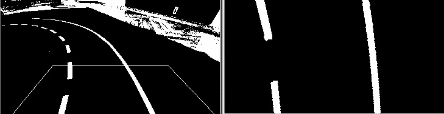
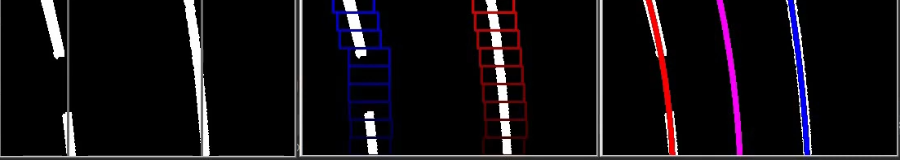
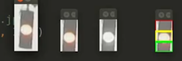
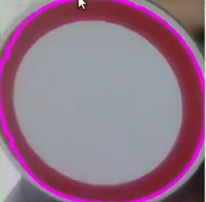
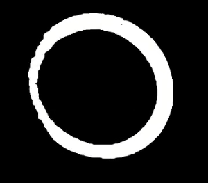

# 🏎️ ATS_nto: Учебный Конспект по Системе Автономного Транспорта


Этот репозиторий представляет собой полноценное учебное пособие по разработке алгоритмов для автономных автомобилей и **решения олимпиадных задач**.

---

## 🏆 Подготовка к Олимпиаде (Olympiad Preparation)

Этот проект содержит стартовый код для задач: Квадрокоптер, Автомобиль и Сервисный центр.

### 1. Сбор Данных и Обучение (Data Collection & Training)
Инструменты для сбора датасета и обучения моделей YOLO.

*   **Сбор данных:** `python3 src/detection/yolo_training/collect_data_advanced.py`
    *   `SPACE` — сохранить фото.
    *   `c` — сменить класс (Person, Defect, Wheel, Debris).
    *   `v` — переключить набор (Train/Val).
*   **Создание конфига:** `python3 src/detection/yolo_training/create_yolo_config.py --name my_dataset --classes person defect`
*   **Аугментация:** `python3 src/detection/yolo_training/augment_data.py --input datasets/raw --output datasets/augmented --count 3`
    *   Позволяет увеличить размер датасета за счет поворотов и отражений.
*   **Разделение датасета:** `python3 src/detection/yolo_training/split_dataset.py --input datasets/augmented --output datasets/final --ratio 0.8`
    *   Автоматически раскладывает фото по папкам `train` и `val`.
*   **Менеджер обучения:** `python3 src/detection/yolo_training/train_manager.py --data datasets/final/data.yaml --model yolov8n.pt --epochs 100`

### 2. Квадрокоптер (Drone System)
Управление квадрокоптером по машине состояний.
*   **Запуск:** `python3 src/drone/main_drone.py`
    *   Логика: `Взлет -> Поиск Дефектов (Фасады) -> Поиск Завалов (Дорога) -> Посадка`.
*   **Зрение:** Редактируйте `src/drone/drone_vision.py`. Не забудьте обновить пути к обученным моделям (`best_defect.pt`, `best_debris.pt`).

### 3. Беспилотный Автомобиль (Car System)
Управление движением в колонне и объездом препятствий.
*   **Запуск:** `python3 src/car/main_car.py`
*   **Зрение:** Редактируйте `src/car/car_vision.py` для настройки трекинга лидера (по цвету или ArUco) и детекции мусора.

### 4. Сервисный Центр (Service Center)
Анализ колес и болтов.
*   **Запуск:** `python3 src/service/main_service.py`
*   **Логика:** Редактируйте `src/service/wheel_analysis.py` для классификации типа колеса (обычное/усиленное) и подсчета болтов.

---

## 🛣️ Модуль 1: Детекция полосы (Lane Detection)
**Цель:** Определить границы дороги и вычислить траекторию движения (полином).

### 1.1. Цветовая сегментация и фильтрация
Чтобы выделить разметку, мы переходим в цветовые пространства, менее зависимые от освещения.
*   **HLS (Hue, Lightness, Saturation):** Канал **S** (Насыщенность) отлично выделяет белые и желтые линии даже под мостом или в тени.

```python
# Пример фильтрации разметки
hls = cv2.cvtColor(resized, cv2.COLOR_BGR2HLS)
s_channel = hls[:, :, 2]
binary = np.zeros_like(s_channel)
binary[(s_channel > 160)] = 255
```

### 1.2. Перспективное преобразование (Perspective Transform)
Мы переходим "из камеры" в "вид сверху" (Bird's Eye View), чтобы линии дороги стали параллельными.

````carousel

<!-- slide -->

````
*На иллюстрациях: Слева — исходный кадр и бинаризация, справа — выделение многоугольника и результат трансформации (warped).*

**Математика:** Мы решаем систему уравнений для поиска матрицы гомографии $M$, которая переводит точки $(x, y)$ в $(x', y')$.
```python
# Настройка точек для "вида сверху"
src = np.float32([[20, 200], [350, 200], [275, 120], [85, 120]])
dst = np.float32([[0, 200], [360, 200], [360, 0], [0, 0]])
m = cv2.getPerspectiveTransform(src, dst)
warped = cv2.warpPerspective(allbinnary, m, (360, 200))
```

### 1.3. Метод скользящего окна (Sliding Window)
После того как мы получили "вид сверху", нужно найти конкретные пиксели линий.
1.  **Гистограмма:** Считаем количество белых пикселей по вертикали. Пики — это основания линий.
2.  **Окна:** Ставим окна на пики и ищем в них пиксели. Если нашли > 50, следующее окно центрируем по ним.


*Визуализация: От поиска пиков гистограммы (argmax) до построения финальных кривых (polylynes).*

---

## 🚥 Модуль 2: Светофоры (Traffic Light Detection)
**Цель:** Определение активного цвета без сложных нейросетей.


*Разбиение области светофора на зоны интереса (ROI) для детектирования цвета.*

### Логика работы:
1.  **Выделение ROI:** Обрезаем кадр так, чтобы в него попадал только светофор.
2.  **Анализ Яркости:** Переходим в HSV и считаем сумму канала **V (Value)** в трех зонах.
3.  **Сравнение:** Секция с максимальной суммой яркости считается активной.

```python
# Определение активной секции
if red_s > yellow_s and red_s > green_s:
    status = "red"
```

---

## 🛑 Модуль 3: Распознавание знаков (Template Matching)
**Цель:** Идентификация контура знака и сравнение с эталоном.


*Поиск контуров и выделение потенциального знака на кадре.*

### Алгоритм:
1.  **Поиск контура:** Через `cv2.findContours` находим объекты нужной формы.
2.  **Бинаризация:** Применяем цветовой порог для выделения значимых пикселей.

3.  **Нормализация:** Приводим найденный объект к размеру эталона (например, **64x64**).
4.  **Метод вычитания (cv2.absdiff):** Считаем разницу между пикселями. Тот эталон, у которого разница минимальна — наш ответ.

```python
# Сравнение с эталоном
diff = cv2.absdiff(roImgResized, reference_image)
similarity = np.sum(diff < 30) # Коротко: сколько пикселей совпало
```

---

## 🔍 Модуль 4: Детектор объектов (SVM + HOG)
**Цель:** Ообучение системы находить любые объекты (пешеходы, машины).


*Результат работы: Детекция нескольких пешеходов одновременно в реальном времени.*

### 4.1. HOG (Histograms of Oriented Gradients)
Вместо того чтобы смотреть на цвета, HOG смотрит на **градиенты** (направления изменения яркости). Это позволяет детектору игнорировать цвет объекта и фокусироваться на его форме.

### 4.2. SVM (Support Vector Machine)
Метод опорных векторов классифицирует признаки HOG на "объект" и "фон".
*   **Обучение:** Мы скармливаем dlib картинки и XML-файлы с координатами рамок (Bounding Boxes).
*   **Использование:** Детектор скользит окном по всему кадру и ищет совпадение с моделью `tld.svm`.

---

## 📂 Организация файлов
*   `src/vision/road/` — Разметка и перспектива.
*   `src/vision/signs/` — Логика распознавания знаков.
*   `src/vision/traffic_light/` — Светофоры.
*   `src/detection/` — Обучение и запуск SVM детектора.
*   `assets/` — Все изображения, маски и обученные модели.

---

> [!IMPORTANT]
> **мы выебем нтошку:**  Дорогие друзья ебашим и тогда нормально сможем вывезти нтошку
